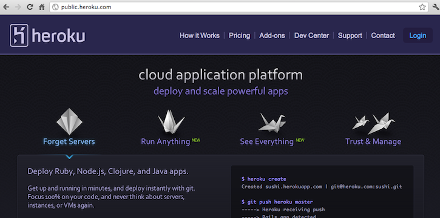
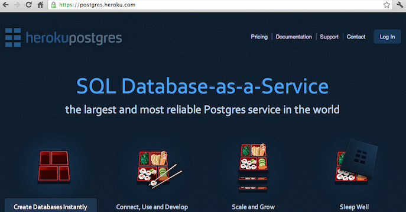
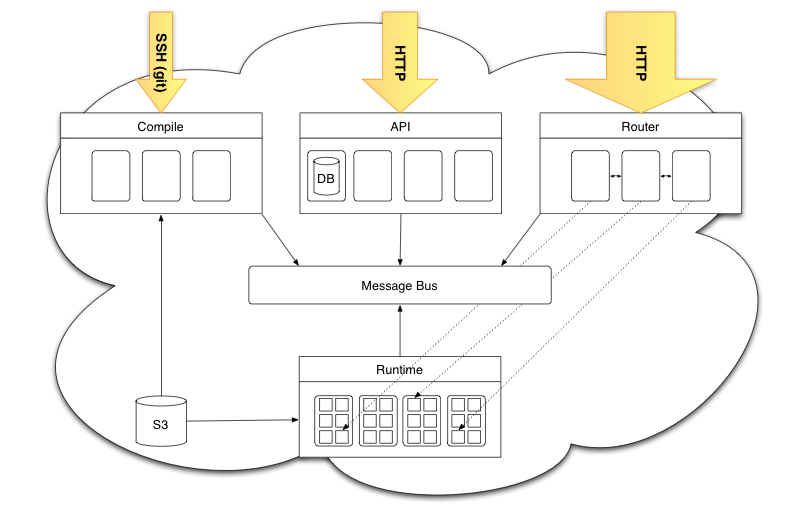
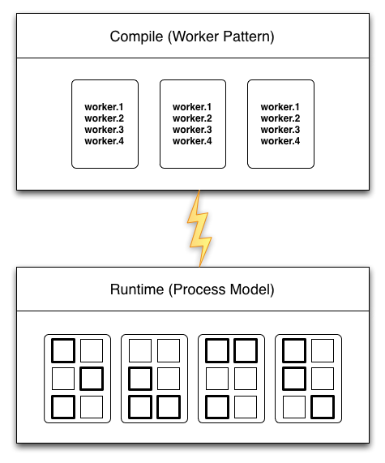

!SLIDE title-slide smbullets incremental
# Self-Hosting #
## A computer program that produces new versions of that same program ##

* Compilers
* Kernels
* Programming Languages
* Revision Control Systems
* Text Editors

FASM; Haiku; GCC; Hart/Levin Lisp in '62; PyPy; Rubinius; CoffeeScript; Git; VIM

!SLIDE title-slide bullets
# Self-Hosting #
## Applicable Metaphor for Services? ##

Service != computer program, but is a comparable system

!SLIDE center
# Heroku Self-Hosting: Easy #
## www.heroku.com ##
## devcenter.heroku.com ##

Many google hits for "self-hosting" wordpress

!SLIDE bullets
# Motivations #
* Dogfooding
* Efficiency
* Separation of Concerns

Used to be unified with API!

!SLIDE commandline
# Heroku Self-Hosting: Normal #
## addons.heroku.com ##
## Cron Addon ##

    $ heroku ps --app cron
    Process       State        Command
    ------------  ---------  --------------------------------------------------
    exec.1        up for 9d  rake resque:work QUEUE=exec
    exec.2        up for 9d  rake resque:work QUEUE=exec
    finder.1      up for 9d  rake resque:work QUEUES=scheduled,missed
    finder.2      up for 8d  rake resque:work QUEUES=scheduled,missed
    scheduler.1   up for 9d  rake resque:scheduler
    web.1         up for 9d  bundle exec unicorn -p $PORT -c ./unicorn.conf.rb
    web.2         up for 9d  bundle exec unicorn -p $PORT -c ./unicorn.conf.rb

Addons split off from API too. Cron built using addons APIs.

!SLIDE smbullets center
# Heroku Self-Hosting: Heroic #
## Database Cloud Built with Heroku Apps #
## Shogun / PGBackups ##

postgres.heroku.com too

!SLIDE
# Heroku Self-Hosting: Legendary? #

Halo difficulty levels

!SLIDE center
# Heroku Architecture #

Runtime is the guts of heroku. Database is important too, not pictured.

!SLIDE center
# Self-Hosted Architecture #

Compiling in a dyno remind you of the LLVM demo?

!SLIDE bullets
# Motivations #
* Dogfooding
* Efficiency
* Separation of Concerns

Same bullets as public.heroku.com. Pattern? Efficiency also uses CPU cycles.

!SLIDE bullets
# Motivations #
* Effortless Scaling
* Decrease Surface Area
* Build/Compile Symmetry
* Secure, Ephemeral Containers

Total ops win: more secure, non-priveledged deploys, kills server class.
Disregard servers, acquire dynos. Not just for rails apps.

!SLIDE
# Demo: Slug Compile #
## Bundle Code for the Heroku Runtime #

!SLIDE code smaller
    @@@ sh
    #!/usr/bin/env bash

    SRC_DIR=1
    TMP_DIR=$(mktemp -d /tmp/t.XXXXX)
    BUILD_DIR=$TMP_DIR/app

    trap "rm -rf $TMP_DIR" EXIT

    # Copy src to build dir
    bin/rsync -avz                                          \
      --exclude vendor/ --exclude .bundle/ --exclude .git/  \
      $SRC_DIR $BUILD_DIR/ 2>&1 | log

    # Bundle with a clean env
    (
      export GEM_HOME=vendor/bundle/ruby/1.9.1
      export HOME=$BUILD_DIR
      export PATH=$GEM_HOME/bin:/usr/local/bin:/usr/bin:/bin

      gem install bundler --pre --no-rdoc --no-ri 2>&1 | log
      bundle install --without development:test --deployment
    )

    [ $? -ne 0 ] && { 
      echo Heroku push rejected, failed to compile app; exit 1;
    }

    # Squash
    mksquashfs $BUILD_DIR $TMP_DIR/slug.img -no-progress -all-root 2>&1 | log
    echo Compiled slug is $(du -h $TMP_DIR/slug.img | cut -f1-1)

!SLIDE commandline smaller
    $ heroku run bin/compile .
    Running bin/compile . attached to terminal... up, run.13
    -----> Heroku receiving push
    -----> Ruby/Rack app detected
    -----> Installing bundler using ruby 1.9.2p180 and gem 1.3.7...
    -----> Installing dependencies using Bundler version 1.1.pre.9
           Running: bundle install --without development:test --deployment
           Fetching dependency information from the API at http://rubygems.org/......
           Installing addressable (2.2.6) 
           Installing blankslate (2.1.2.4) 
           Installing bluecloth (2.1.0) with native extensions 
           Installing gli (1.3.3) 
           Installing launchy (2.0.5) 
           Installing mime-types (1.16) 
           Installing rest-client (1.6.3) 
           Installing term-ansicolor (1.0.6) 
           Installing heroku (2.5.0) 
           Installing json (1.6.0) with native extensions 
           Installing kgio (2.0.0) with native extensions 
           Installing nokogiri (1.5.0) with native extensions 
           Installing parslet (1.2.1) 
           Installing rack (1.3.2) 
           Installing tilt (1.3.3) 
           Installing sinatra (1.2.6) 
           Installing showoff (0.7.0) 
           Installing unicorn (3.0.0) with native extensions 
           Using bundler (1.1.pre.9) 
           Your bundle is complete! It was installed into ./vendor/bundle
           Cleaning up the bundler cache
    -----> Compiled slug is 13M

!SLIDE center
# What Else? #

API is just a Rails app
Could Router?
DB (postgres) Process
Message Bus (rabbitmq, redis) Process

!SLIDE center smbullets
# Challenges #
* Circular Dependencies
* CGFs

Ouroboros. Cascading Global Failure. Engineering challenges and puzzles, not the end of the world

